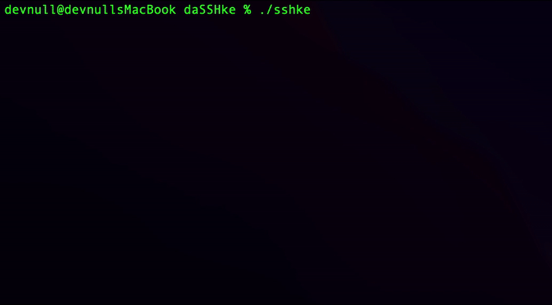

# daSSHke



This is a lightweight, ergonomic, and fast terminal based (TUI) SSH connection manager written in Go. It offers simple yet powerful features, including the ability to read hosts from `/etc/hosts`, `~/.ssh/config`, or its own settings file. With built-in autocomplete and menu-based navigation, it provides a seamless and efficient experience for quickly managing and connecting to SSH hosts. Cross-platform and 
easy to use, this tool prioritizes convenience without overcomplicating things.

It helps me, maybe it will help you too!

# Command line parameters

* `./sshke`    shows connection options in menu style with `-m` switch, or in text based navigation style otherwise.
* `./sshke -v` show version
* `./sshke -c` connects to the host and adds it to the local config file for later use, the syntax is user@host:port, can be used without user or port specified.

# Config file parameters

Config file is located in `~/.config/daSSHke/settings.ini`

```
[UI]
showmenu = true # always show navigation in menu style

[General]
autoaddhosts = true # autoadd hosts to the config file section [servers] on the first connect.
loadsshhosts = false # load hosts from ~/.ssh/config
loadetchosts = true # load hosts from /etc/hosts file
[servers]
server1       = root@192.168.1.1:22
server2       = root@192.168.1.2
server3       = 192.168.1.3
```

# Sync

Sync servers list between computers using github gist system, this way it stores servers list in private gist. On github navigate: Settings → Developer 
Settings → Personal Access Token  → Tokens (classic) and Generate a classic token with gist scope, copy it to **gistsecret**, Nagitate https://gist.github.com/ and 
create secret gist, copy its id after **gist:** and put to **gistid**.

Enable it in configuration:
```
[General]
sync = true
gistid = gist_id
gistsecret = classic access token
```


